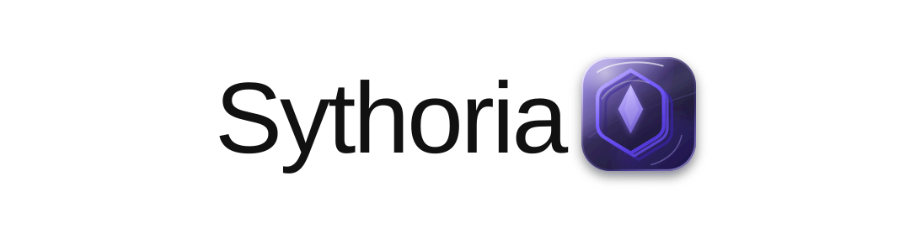

<div align="center">

<picture>
  <source media="(prefers-color-scheme: dark)" srcset="./public/sythoria-header-dark.svg" />
  
</picture>

<p>
  <a href="https://github.com/sythoria/sythoria-desktop/releases/latest"><picture><source media="(prefers-color-scheme: dark)" srcset="https://www.shieldcn.dev/github/release/sythoria/sythoria-desktop.svg?variant=outline&amp;size=sm&amp;mode=dark&amp;font=geist" /></picture></a>
  <a href="#installation"><picture><source media="(prefers-color-scheme: dark)" srcset="https://www.shieldcn.dev/badge/platforms-Windows_%C2%B7_macOS_%C2%B7_Linux.svg?variant=outline&amp;size=sm&amp;mode=dark&amp;font=geist&amp;logo=ri:ComputerLine" /></picture></a>
  <a href="./src/utils/i18n/"><picture><source media="(prefers-color-scheme: dark)" srcset="https://www.shieldcn.dev/badge/interface-6_languages.svg?variant=outline&amp;size=sm&amp;mode=dark&amp;font=geist&amp;logo=googletranslate" /></picture></a>
  <a href="./LICENSE"><picture><source media="(prefers-color-scheme: dark)" srcset="https://www.shieldcn.dev/github/license/sythoria/sythoria-desktop.svg?variant=outline&amp;size=sm&amp;mode=dark&amp;font=geist" /></picture></a>
  <a href="https://github.com/sythoria/sythoria-desktop/stargazers"><picture><source media="(prefers-color-scheme: dark)" srcset="https://www.shieldcn.dev/github/stars/sythoria/sythoria-desktop.svg?variant=outline&amp;size=sm&amp;mode=dark&amp;font=geist&amp;logo=github" /></picture></a>
</p>

<p>
  <a href="#architecture"><picture><source media="(prefers-color-scheme: dark)" srcset="https://www.shieldcn.dev/badge/Tauri-2.svg?variant=outline&amp;size=sm&amp;mode=dark&amp;font=geist&amp;logo=tauri" /></picture></a>
  <a href="#architecture"><picture><source media="(prefers-color-scheme: dark)" srcset="https://www.shieldcn.dev/badge/backend-Rust.svg?variant=outline&amp;size=sm&amp;mode=dark&amp;font=geist&amp;logo=rust" /></picture></a>
  <a href="#architecture"><picture><source media="(prefers-color-scheme: dark)" srcset="https://www.shieldcn.dev/badge/React-19.svg?variant=outline&amp;size=sm&amp;mode=dark&amp;font=geist&amp;logo=react" /></picture></a>
  <a href="#architecture"><picture><source media="(prefers-color-scheme: dark)" srcset="https://www.shieldcn.dev/badge/language-TypeScript.svg?variant=outline&amp;size=sm&amp;mode=dark&amp;font=geist&amp;logo=typescript" /></picture></a>
  <a href="./package.json"><picture><source media="(prefers-color-scheme: dark)" srcset="https://www.shieldcn.dev/badge/coverage-enabled.svg?variant=outline&amp;size=sm&amp;mode=dark&amp;font=geist&amp;logo=vitest" /></picture></a>
  <a href="#security-and-privacy"><picture><source media="(prefers-color-scheme: dark)" srcset="https://www.shieldcn.dev/badge/storage-encrypted_locally.svg?variant=outline&amp;size=sm&amp;mode=dark&amp;font=geist&amp;logo=ri:Lock2Line" /></picture></a>
</p>

<p><strong>The private desktop interface for local and hosted AI models.</strong></p>

<p>
  Chat with any provider, compare answers side by side, use web and MCP tools, dictate prompts,<br />
  and let agents work safely inside isolated project worktrees.<br />
  Your keys, conversations, and settings stay encrypted on your device. No account, hosted model service, or telemetry.
</p>

<p>
  <a href="https://github.com/sythoria/sythoria-desktop/releases/latest">Download</a> ·
  <a href="#installation">Install</a> ·
  <a href="#features">Features</a> ·
  <a href="#supported-connections">Connections</a> ·
  <a href="#security-and-privacy">Security</a> ·
  <a href="https://sythoria.com/docs">Documentation</a> ·
  <a href="./CONTRIBUTING.md">Contributing</a>
</p>

<br />


</div>

---

Sythoria is a desktop client for chatting with local and hosted language models. It combines standard chat functionality with model comparison, web and MCP tools, voice input, and project-aware coding workflows.

The application runs on Tauri, with a Rust backend handling provider requests. There is no Sythoria-hosted model service and no telemetry. You must provide your own API credentials or connect to a local Ollama instance.

## Features

- **Multi-Provider Chat**: Stream responses from OpenAI, Anthropic, Gemini, Ollama, NVIDIA NIM, OpenRouter, and custom OpenAI-compatible endpoints.
- **Model Comparison**: Run the same prompt against up to four different models simultaneously in a synchronized view.
- **Agentic Tool Loop**: Provide models with access to web search, page fetching, MCP (Model Context Protocol) servers, and project workspace tools.
- **Project Workspaces**: Grant models `read`, `write`, or `full` access to a designated directory. For Git repositories, file changes are isolated in a temporary worktree, allowing you to review edits before applying them.
- **Artifact Previews**: Render HTML and SVG artifacts in a sandboxed split pane with opt-in network access.
- **Voice & Attachments**: Attach images and files, capture the screen, and dictate using local `whisper.cpp` models or a cloud transcription endpoint.
- **Encrypted Local Storage**: Conversations and configuration files are protected with AES-256-GCM domain-separated encryption.

## Supported Connections

| Capability   | Built-in Options                                                            |
| ------------ | --------------------------------------------------------------------------- |
| **Models**   | OpenAI, Anthropic, Gemini, Ollama, NVIDIA NIM, OpenRouter, custom endpoints |
| **Search**   | Google Custom Search, SearXNG, Firecrawl                                    |
| **Fetching** | Firecrawl, Jina Reader                                                      |
| **MCP**      | `stdio`, `SSE`, and Streamable HTTP transports                              |
| **Voice**    | Local `whisper.cpp` models or cloud endpoints                               |

Model presets can be modified. You can override the endpoint URL, model ID, context size, output limits, temperature, system prompts, and reasoning levels.

## Security and Privacy

Sythoria operates within the following boundaries:

- **API Keys**: Stored in authenticated local encryption derived from one root key in the operating system credential vault. Decryption stays in Rust, and Sythoria does not sync keys to an external server.
- **Prompt Routing**: The Rust backend connects directly to the provider endpoint you configure.
- **Telemetry**: The application does not collect analytics or tracking data.
- **Workspace Security**: Project edits and commits require explicit user approval unless `full` access is granted. Shell commands always require a native confirmation dialog.
- **Network Boundaries**: Outbound endpoints are strictly validated. Private and local IPs are blocked by default and require an explicit per-provider opt-in.

## Installation

### Linux

Use the universal installer script for Debian, Ubuntu, Fedora, Arch, and other Linux distributions:

```bash
curl -fsSL https://raw.githubusercontent.com/sythoria/sythoria-desktop/main/install.sh | bash
```

For **Windows** and **macOS**, download the latest installer from the [Releases page](https://github.com/sythoria/sythoria-desktop/releases/latest).

## Getting Started

### Local Development

#### Requirements

- Node.js 20+ and npm
- Rust stable (`rustup`)
- Git
- Native build dependencies for Tauri (e.g., C++ Build Tools & WebView2 on Windows; Xcode Command Line Tools on macOS; WebKitGTK on Linux). See [CONTRIBUTING.md](CONTRIBUTING.md#local-development-setup) for details.

#### Run the Application

```bash
git clone https://github.com/sythoria/sythoria-desktop.git
cd sythoria-desktop
npm install
npm run tauri dev
```

_Note: Go to **Settings > Models** on first launch to add a provider and select a model. Running `npm run dev` starts the web frontend only and lacks backend integration._

#### Build an Installer

```bash
npm run tauri build
```

## Architecture

```text
InputBar / ChatArea
        |
useChatStore (Zustand)
        +-- Direct Chat -> Tauri Command -> Provider SSE Stream
        +-- Tool Loop   -> Search / Fetch / MCP / Skills / Subagents / Project Tools
                                      |
                              Rust validation and I/O
```

- **Frontend**: React 19 and TypeScript. State is managed by Zustand across distinct stores (Conversations, Models, Search, MCP, Projects, Git, UI, Voice, Capture, Keybinds).
- **Backend**: Rust via Tauri. Manages network requests, SSE/WebSocket parsing, OS keychain access, AES-256-GCM storage, MCP transports, Git worktree boundaries, file I/O, screen capture, and audio recording.

## Development Commands

| Command                      | Purpose                                        |
| ---------------------------- | ---------------------------------------------- |
| `npm run tauri dev`          | Run Vite on port 1420 and open the desktop app |
| `npm run dev`                | Run the frontend only                          |
| `npm run build`              | Type-check and build the frontend              |
| `npm run tauri build`        | Build the native desktop bundles               |
| `npm run test`               | Run the Vitest test suite                      |
| `npm run lint`               | Run ESLint                                     |
| `npm run format:check`       | Check Prettier formatting                      |
| `cd src-tauri && cargo test` | Run the Rust backend tests                     |

## License

Sythoria is available under the [MIT License](LICENSE). Third-party components remain subject to their respective licenses; see [THIRD_PARTY_NOTICES.md](THIRD_PARTY_NOTICES.md).
